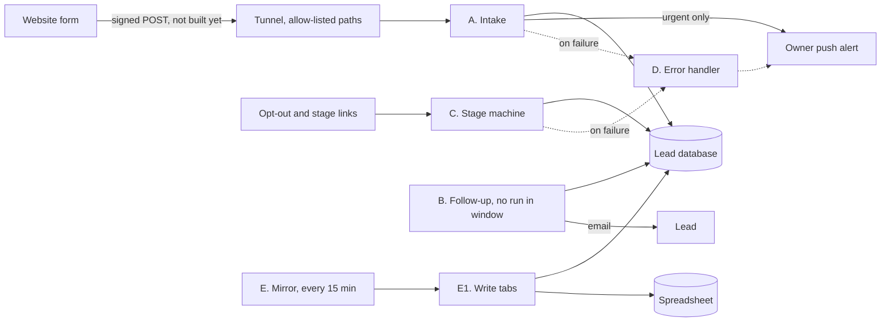

# n8n estate report — state, go-live, and the client-facing offer

**Measured 2026-09-06 against the live instance. Read-only.** Every claim in Section A carries the
command that produced it in the evidence register (A4). Anything not measured is tagged
`[UNVERIFIED]` and says so where it appears.

Two audiences, deliberately separated:

- **Section A** is for whoever operates this instance. It says what runs, what is broken, and the
  exact steps between today and a first real lead.
- **Section B** is client-facing copy for the automation offer. It names no tool and quotes no
  price, because the brand's voice guide forbids both.

> **Retention changes what "never" means.** `EXECUTIONS_DATA_PRUNE=true` with
> `EXECUTIONS_DATA_MAX_AGE=168` keeps 168 hours of execution history. The oldest row on the
> instance is exactly 168 hours old. Every count below is therefore **"in the 168-hour window"**,
> never "ever". An earlier draft of this report said "0 runs ever" in four places and was wrong.

---

# Section A — Operator

## A0. State by outcome

Three lanes. The question each answers is "can this produce revenue this month", not "is the
workflow enabled".

### Lane 1 — Lead pipeline: built and mostly live, not yet reachable by a real customer

| What runs today | What blocks a real lead |
| --- | --- |
| Intake and the sheet mirror are measured published; the stage machine, error handler and mirror sub-workflow are inferred published from the legacy column. Intake ran 15 times in the window, all successful. The error handler has never run, which is Blocker 1, and the mirror pair persists no executions by design, so its silence is not evidence either way. | The public route does not exist. No DNS record, no tunnel entry, so the website form cannot reach the pipeline. |
| The mirror runs on a schedule, resolves its spreadsheet by name with an ownership check, and writes both tabs. Verified end to end. | The website form does not sign or forward submissions. That is unwritten work in the website repository, not here. |
| The lead database is healthy and empty: four tables, zero rows. | Error routing is unproven. A qualifying failure produced no handler execution. Blocker 1 below. |
| Follow-up shows as unpublished behind the opt-out gate, with no scheduled run in the window. | Intake and stage executions persist their payloads. Blocker 2 below. |

### Lane 2 — Client acquisition: the machine is not running

The outreach engine exists in this repository as five workflows and **none are imported**. Workflow
JSON here is inert until imported; `scripts/import-workflows.sh` says so in its header. The
project's own README says not to activate the sender yet, and its secret manifests are still a
to-do. Separately, the goal brief that governs this work records **zero sends against a target of
one hundred**, and its day-45 tripwire falls on **2026-09-10**. Detail lives with the brief, not in
this repository.

The honest summary: there is no lead-generation activity, so the pipeline has nothing to carry.
Publishing the route matters, and so does starting to send.

### Lane 3 — Estate hygiene: 15 of 22 rows do no useful work

| Group | Count | State |
| --- | --- | --- |
| Desk Architecture | 7 | Zero runs in the window, and the legacy column shows them unpublished, which is unmeasured — see the appendix caveat. Superseded by a decision record in the infrastructure repository; that record states the system never functioned end to end. |
| Duplicate demo workflows | 3 | Same names as the originals, created three weeks later. They own the registered webhook paths, so they are the copies that answer. Queued for archival. |
| Sync health monitor | 1 | Runs roughly 48 times a day. Every run fails to resolve its target, whose namespace no longer exists. The failure lands on an unconnected error output, so each run is recorded as a success and the alert branch cannot fire. It monitors nothing and reports green. |
| Demo kit | 3 | Its shared mail credential is disabled, so the kit cannot send mail. It cannot be demonstrated as-is. |
| Reference workflow | 1 | A downloaded community template, untracked by git, no credentials. |

Eleven rows are archival candidates, and four more (the demo kit and the reference workflow) cannot be used as they stand. One monitor is actively misleading.

### What stands between today and a paying client

Ordered. Owner in brackets.

1. **Prove error routing works.** [me] Blocker 1.
2. **Stop persisting intake payloads.** [me] Blocker 2.
3. **Rotate the shared alert topic and purge the literal from this repository.** [me, approval] Blocker 3.
4. **Publish the route:** tunnel entry with a path allow-list, then the DNS record, then the route carve-out. [me, one credential from you]
5. **Sign and forward submissions from the website form.** [me, separate repository, separate pull request]
6. **Turn on the follow-up sequence** after the opt-out link resolves from outside the network. [me]
7. **Fix or retire the demo mail credential** so the kit can be shown. [you]
8. **Start sending.** [you] Without this, one to six produce an empty pipeline.

Items one to six are mine and need one credential from you. Item seven is a dashboard action only
you can take. Item eight is the one that actually produces revenue.

## A1. Lead pipeline: architecture and what is verified

The pipeline tracks two independent facets per lead, a commercial stage and a calendar stage, so a
lead can be, for example, proposal-sent and consultation-booked at once without one overwriting the
other. Stage changes are appended to an event table rather than overwriting, which is what makes
the audit trail in Section B truthful.

**Verified, with evidence in A4:** the mirror resolves its spreadsheet by exact name and rejects any
file it does not own, tested with thirteen cases including an attacker-owned file and two mutations
that each make a specific case fail; a scheduled mirror run wrote both tabs end to end; the mirror
and its sub-workflow persist no execution data.

**Not verified, and treated as blockers:** error routing, and payload persistence on the intake and
stage workflows. Both are in A2.

## A2. Go-live: executable steps with a pass criterion each

Every step states what proves it worked. A step with no artifact is not done.

### Blocker 1 — Prove error routing fires

A stage-machine failure in the window ran in webhook mode, raised a node operation error, and its
stored snapshot carried the error-workflow setting pointing at the handler. No handler execution
followed. The 2.16 code path gates only on self-recursion, so a manual-mode exemption does not
explain it. Root cause is `[UNVERIFIED]`: the relevant log line is debug level and the pod that ran
it has been replaced.

- **Do:** raise the log level on the main pod, inject a named failure in a non-manual mode, and
  watch for the handler.
- **Pass:** handler execution count increases by one, and a push alert arrives.
- **If it still does not fire:** the error handler is not a safety net, and that changes the
  risk of every later step. Stop and re-plan rather than proceeding.

### Blocker 2 — Stop persisting intake and stage payloads

Both workflows save their run data under the instance default. Fifteen intake executions and two
stage executions currently hold full submission payloads including email addresses and budget
bands. Rows expire with the retention window, on 2026-09-12 for the oldest.

- **Do:** set `saveDataSuccessExecution: none` and `saveDataErrorExecution: none` on both, using a
  `PUT` to the public API, which preserves activation and needs no restart. Then purge the existing
  rows.
- **Pass:** a fresh test submission leaves no row in the execution data table matching its address.
- **Caveat, measured earlier and still true:** in queue mode a *failed* main-workflow run persists
  its data regardless of these settings. The sub-workflow route used by the mirror is what actually
  contains payloads. Intake cannot use that route without a redesign, so these settings reduce
  exposure rather than eliminating it, and the retention window remains the backstop.
- **Approval:** purging rows is destructive. Alternative: let the window clear them by 2026-09-12
  and set the flags now so nothing new is written.

### Blocker 3 — Rotate the shared alert topic

Five workflow files in this repository hardcode a push-notification topic that is public and
unauthenticated in both directions. Nothing publishes to it today, because the outreach workflows
are not imported and the monitor's alert branch cannot fire. But anyone reading this public
repository can push messages to it, and the outreach workflows would publish prospect details to it
the day they are imported. The lead pipeline already does this correctly, reading its topic from
Vault, so this is the unmigrated half of an existing control.

- **Do:** generate a random topic, store it in Vault, replace the literal in all five files with the
  environment reference, treat the old topic as burned.
- **Pass:** no literal topic remains in the repository, and a test push reaches the phone on the new
  topic only.
- **Approval:** own small pull request, ahead of everything else, because publishing this report
  draws attention to the repository.

### Route to the public internet

Order matters. The allow-list must exist before the hostname resolves.

1. **Tunnel entry first,** in the infrastructure repository, with the path allow-list written
   exactly as `^/webhook/(lead-intake|lead-stage)$`. Anchored at both ends and with no wildcard, so
   the demo endpoints, the login page, the API and the health endpoint are not exposed. Origin is
   the ingress over HTTPS with TLS verification disabled and the server name overridden, because the
   cluster uses a private certificate authority with an empty subject.
   **Pass:** the tunnel's own configuration shows the entry; that application auto-syncs, so merging
   is deploying. Approval required.
2. **DNS record second:** a proxied CNAME for the `hooks` hostname pointing at the tunnel.
   **Pass:** the name resolves and the tunnel answers.
3. **Route carve-out third:** the site's edge worker serves this zone. If its route pattern is a
   wildcard, it intercepts the new hostname and the lead POST gets the site's 404 page instead of
   the pipeline. **Pass:** a POST returns 400 from the pipeline, which means the request reached it,
   not the site's 404 page.
4. **Negative checks, from outside the network.** All five must return 404 through the tunnel: the
   two demo endpoints, the login page, the API root, the health endpoint. A positive-only check
   cannot detect an over-broad allow-list.
5. **Configuration change, with a diff for approval:** the chart sets `N8N_WEBHOOK_URL`, but the
   application reads `WEBHOOK_URL` only. The value is currently ignored and the base URL falls back
   to localhost on both the main and worker deployments. Rename in both templates, keep the internal
   hostname as the value, and add the pipeline's own public base variable, which is absent from the
   environment today. Proxy hop count goes from one to two, because the new path adds the tunnel.
   **Pass:** a rendered chart diff, then a follow-up link in a test email that resolves.

### Then, in order

6. **Signing and forwarding from the website form.** Separate repository, separate pull request:
   sign the submission, post it to the pipeline after the acknowledgement email is queued so the
   visitor's response is never gated on it, and match the name validation the pipeline enforces so a
   name it would reject is caught in the browser instead of vanishing after a success message.
7. **Opt-out link must not act on GET.** Mail scanners prefetch links in delivered mail, which would
   unsubscribe recipients who never clicked. The GET renders a confirmation page; the button posts.
8. **Publish in order:** confirm the error handler and stage machine are published, which the legacy column suggests they already are, then publish follow-up last. Follow-up last, or the first
   send mints long-lived links pointing at a route that does not answer.
9. **One real lead, urgent.** Four artifacts or it did not happen: the lead row appears, a push
   alert arrives, a stage token exists, and the row reaches the spreadsheet within fifteen minutes.
   Use an urgent timeline or a high budget band, because the push fires on the urgent branch only.

### Carried-over fixes, none blocking

Standalone-run warning on the mirror sub-workflow; reconcile the pipeline README with the current
two-workflow mirror design; correct the row count the sub-workflow reports, which currently reflects
one branch of two; pin the progress-save flag off explicitly rather than relying on the default;
re-assert the ownership check inside the sub-workflow; encrypt the database dump.

## A3. Estate hygiene

Each item states the approval it needs.

- **Archive eleven rows** — seven Desk Architecture, three duplicates, one dead monitor. Use the
  editor's own path, not the public API's deactivate: that endpoint clears the legacy active column
  without clearing the published-version pointer, which is exactly how four workflows ended up
  running while the interface showed them as inactive. **First step, before touching anything:**
  query the published-version pointer for all eleven rows. Four of them, the three duplicates and
  the monitor, are measured published and so are running right now: they need unpublishing before
  archiving, not archiving alone. The other seven have an unmeasured published state, and any that
  comes back published joins the first group. **Pass:** the pointer is queried for all eleven, and the
  startup log no longer activates them. **Destructive, approval required.**
- **Demo mail credential** — disabled, so the kit cannot send. Fix it or retire the kit. **Yours.**
- **Video publishing workflow** — shows as unpublished (unmeasured, per the appendix caveat) and its supporting services still run. Keep dormant, or
  scale those services to zero and reclaim the capacity. **Your call.**
- **Outreach engine** — import only after its secret manifests exist, not before.
- **Delete the superseded demo intake file** from this repository. **Approval required.**
- **Refresh the production checklist.** Eight of its pre-deployment boxes are done on the live
  instance; the follow-up gate is the one genuinely open item.
- **Follow-up pull request:** two personal addresses appear in thirteen places across this
  repository, and a private network address appears in a demo README. Scrub them.
- **Note for the website repository:** three transitional service values were dated for deletion on
  2026-09-01 and are five days overdue.

## A4. Evidence register

Commands are read-only. Output is trimmed to the relevant lines; no credential values, addresses or
identifiers appear here.

| Claim | Command | Result |
| --- | --- | --- |
| 22 workflows exist | `SELECT id, name, active, "isArchived", "triggerCount", "createdAt"::date, "updatedAt"::date, settings::text FROM workflow_entity ORDER BY name` | 22 rows. This query does **not** read the published-version pointer |
| Published flag, measured | the same select plus `"activeVersionId" IS NOT NULL AS published`, `WHERE id IN (nine ids)` | 9 rows, every one published true |
| The other 13 rows, inferred | legacy `active` column from the inventory query, plus trigger type and window health | 3 with the column true are published, because the write paths set both together; 10 with it false are inferred unpublished, corroborated by the schedule argument below |
| Activation reads the version pointer | `getAllActiveIds` in the workflow repository | `where: { activeVersionId: Not(IsNull()) }` |
| Four rows are published while the legacy column says otherwise | published flag queried per id; main pod startup log | published true for the monitor and all three duplicate copies; the log shows `Activated workflow` for the monitor and two of the three pairs, the third falling outside the filter used |
| Trigger types and node counts | `SELECT ... jsonb_array_elements(nodes::jsonb) ... WHERE type ~* 'trigger|webhook|schedule|cron'` per workflow | one row per workflow; the Trigger column in the appendix comes from here, not from the inventory query |
| Retention window | pod environment; oldest execution row | prune on, max age 168; oldest row exactly 168 h old |
| Intake and stage persist payloads | join execution data to workflows, match an address pattern | 15 and 2 executions; domains present, addresses not printed |
| Mirror persists nothing | same query for the mirror pair | zero rows matching the canary |
| Error routing did not fire | failed stage execution's mode, class and stored settings; handler execution count | webhook mode, node operation error, snapshot points at the handler, handler count zero |
| Monitor fails silently | node error setting and connections; namespace lookup | continue-on-error output unconnected; namespace not found; 336 runs recorded successful |
| Demo kit cannot send | both copies' failed executions | authentication rejected, 7 failures each in the window |
| Duplicates own the paths | webhook table; upsert key in the webhook service | one row per path and method, owned by the later copies; last activation wins |
| Webhook base ignored | grep the deployed source for every token ending in the variable name | one hit, reading the un-prefixed name; the prefixed name appears nowhere |
| Lead database empty | row counts | four tables, zero rows |
| Chart matches git | ArgoCD application status | synced, healthy, at the current main commit |

**`[UNVERIFIED]`** — the published state of the 10 rows this report marks unpublished. Only the legacy column was read for them, and the monitor proves that column can disagree with reality. They show no runs in the window, so the practical risk is low, but the flag itself is unmeasured and is re-checked before the archival step in A3; why error routing did not fire; whether renaming a spreadsheet header trips the
node's schema check, which is read from source but not measured; the mechanism that produced the
four divergent activation rows, which is inferred from the public API's handler.

## Appendix — the 22 workflows

Health is in the 168-hour window. Identifiers are omitted deliberately.

**Read the Published column with one caveat, in three tiers.** The published-version pointer was
queried directly for nine rows, and every one came back published. Three more, the stage machine,
the error handler and the sheet tabs, show the legacy column true; that direction is sound,
because the write paths set both together. The remaining ten show the legacy column false and
were never queried, and the sync health monitor is the standing proof that this direction can
lie.

What corroborates those ten without settling them: nine carry a schedule trigger, and a
published schedule trigger fires, so no runs across the window is at least consistent with
being unpublished. It does not prove it, and two facts from this same report cut the other
way. A weekly schedule can legitimately produce nothing inside a 168-hour window, and one of
the ten is a weekly workflow. The estate also runs workflows that persist no executions at
all, so an absence of rows is not an absence of runs. Treat this as corroboration, not proof.
The approval workflow is webhook-only and has no such evidence either way. The flag is re-queried before
anything is archived.

| Workflow | Project | Published | Trigger | Window health | Credentials | Verdict |
| --- | --- | --- | --- | --- | --- | --- |
| A — Intake | Lead pipeline | yes | webhook | 15 success | crypto, database | Production, blocker 2 |
| B — Follow-up | Lead pipeline | no | schedule ×2 | none | database, mail | Correctly gated |
| C — Stage machine | Lead pipeline | yes | webhook ×2 | 1 success, 1 error | crypto, database | Production, blockers 1–2 |
| D — Error handler | Lead pipeline | yes | error | none | none | Blocker 1 |
| E — Mirror | Lead pipeline | yes | schedule | not persisted by design | sheets | Production |
| E1 — Write tabs | Lead pipeline | yes | sub-workflow | not persisted by design | sheets, database | Production |
| W1 — Client intake | Demo kit | yes | webhook | none | sheets, mail | Demo, mail dead |
| W1 — duplicate | Demo kit | yes | webhook | none | sheets, mail | Archive |
| W2 — Document chase | Demo kit | yes | schedule | 7 errors | mail | Demo, mail dead |
| W2 — duplicate | Demo kit | yes | schedule | 7 errors | mail | Archive |
| W3 — Quote dispatch | Demo kit | yes | webhook | none | mail | Demo, mail dead |
| W3 — duplicate | Demo kit | yes | webhook | none | mail | Archive |
| Sync health monitor | Standalone | yes | schedule | 336 "success", all failing | none | Archive, misleading |
| Approval | Desk Architecture | no | webhook | none | none | Archive, superseded |
| Bridge ping | Desk Architecture | no | schedule | none | none | Archive, superseded |
| Weekly review | Desk Architecture | no | schedule | none | none | Archive, superseded |
| Heartbeat | Desk Architecture | no | schedule | none | none | Archive, superseded |
| Reconcile | Desk Architecture | no | schedule | none | none | Archive, superseded |
| Review handler | Desk Architecture | no | schedule, webhook | none | none | Archive, superseded |
| Supervisor | Desk Architecture | no | schedule | none | none | Archive, superseded |
| Social publish | Video pipeline | no | schedule | none | oauth | Dormant, infra running |
| Short-form generator | Reference | no | schedule | none | none | Untracked reference |

Five credentials exist: crypto, a spreadsheet service account, the lead database, the demo mail
account (disabled), and the pipeline mail account.

---

# Section B — From enquiry to signed client, without the admin

## The problem

A South African business wins work it never hears about. An enquiry arrives on a Friday afternoon,
sits in an inbox over the weekend, and by Monday the customer has called someone else. The next one
gets a reply, then no follow-up, because following up is somebody's memory rather than somebody's
system. Nobody can say how many enquiries came in last month or what happened to them.

This is not a sales problem. It is an admin problem that looks like a sales problem.

## What the system does

Four outcomes. Each one is a system, not a habit.

**Every enquiry is captured and acknowledged.** The moment a form is submitted, the enquiry is
recorded and the sender gets a reply. Not when someone opens the inbox. The reply goes out even if
everyone is in a meeting.

**Urgent enquiries reach you immediately.** The system reads what the enquiry says about timing and
budget, and the ones that cannot wait produce an alert on your phone. The rest wait their turn
without producing noise.

**Nothing falls through.** A follow-up sequence runs on its own schedule, stops the moment the
person replies or books, and carries a working opt-out in every message. Follow-up stops being a
task somebody remembers.

**One shared view, and a record of what happened.** Every enquiry appears in one shared list your
team can already open and read, updated automatically. Behind it, every change of state is recorded in
order: what changed, when, and what triggered it. You can answer "what happened to that enquiry"
with a fact instead of a guess.

## How an engagement runs

Four phases, every time. Discovery, analysis, roadmap, then build and iterate.

Discovery and analysis find the manual work that is actually costing hours, rather than assuming it.
The roadmap says what gets built first and why. Then it gets built, in agreed increments.

Scope is agreed in writing before anything is built. You work with the person who designs the
system, not a hand-off. And nothing is delivered until the agreed workflows run end to end at the
walkthrough.

## What you get

- A written findings document: where the manual work is, what it costs in hours, and what to fix
  first.
- The agreed workflows, built and running in your environment.
- A walkthrough where you watch them run end to end, on your own data.
- Written documentation of what was built and how to change it.
- An agreed period of support after handover.

**Not included:** website design or launch, hosting, and general software development. We build
automation, search visibility and marketing systems. If a project needs work outside those, we say
so before you commit rather than after.

## What we can honestly claim

An engineering background built inside leading South African financial institutions. You work with
the person who designs the system.

No client has yet agreed to be named for this work, so we are not going to imply otherwise. What we
can offer instead is a live walkthrough of a working enquiry-to-client system, running end to end,
before you commit to anything.

Every enquiry through the contact form is answered within one business day. That is our commitment,
not a client's result. Hold us to it.

## What it costs

We quote scope after a short assessment, because job size varies more than the day rate does. The
assessment tells you what the work is before you commit to it. The contact form asks for a budget
range and a timeline so the first conversation starts from what is realistic for you.

## The next step

Use the contact form. Describe the process that is eating your week. You will get a reply within one
business day, and the first conversation is about your process, not our tooling.
